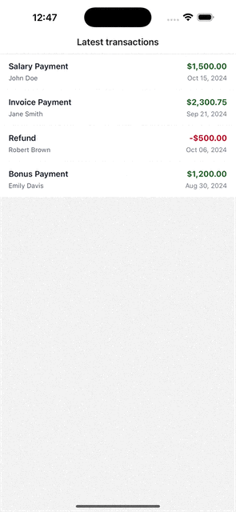

# MobileTransactions

React Native (TypeScript) app for viewing a list of latest transactions and a transaction details screen with share support.

## Requirements covered

- Transactions list shows:
	- Transfer details (transfer name + recipient)
	- Date of transfer
	- Amount of transfer (supports negative amount)
- Tap a transaction → navigates to details screen
- Details screen shows:
	- Reference ID
	- Date
	- Recipient name
	- Transfer name
	- Amount
- Share details externally (native share sheet)
- State management: Zustand

## Project structure

- `src/data/mockTransactions.ts` – mocked BE response data
- `src/store/transactionsStore.ts` – Zustand store + mocked fetch
- `src/screens/transactions/*` – list + detail screens
- `src/utils/format.ts` – date/money formatting

## Setup

### Prerequisites

- Node.js (see `package.json` → `engines.node`)
- React Native environment setup:
	- https://reactnative.dev/docs/environment-setup

### Install dependencies

```zsh
cd MobileTransactions
npm install
```

## Run

### iOS

If CocoaPods isn’t installed yet:

```zsh
sudo gem install cocoapods
```

Install pods:

```zsh
cd ios
pod install
cd ..
```

Run:

```zsh
npm run ios
```

### Android

#### If you see an error like:

```
SDK location not found. Define a valid SDK location with an ANDROID_HOME environment variable or by setting the sdk.dir path in your project's local properties file at '.../android/local.properties'.
```

**Fix:**

1. Find your Android SDK path. On macOS, it's usually:
	```
	/Users/<your-username>/Library/Android/sdk
	```
2. In the `android` folder, create or edit a file named `local.properties` and add:
	```
	sdk.dir=/Users/<your-username>/Library/Android/sdk
	```
	Replace `<your-username>` with your actual username.

Alternatively, set the `ANDROID_HOME` environment variable in your shell config (e.g., `~/.zshrc`):
```sh
export ANDROID_HOME=$HOME/Library/Android/sdk
export PATH=$PATH:$ANDROID_HOME/emulator:$ANDROID_HOME/tools:$ANDROID_HOME/tools/bin:$ANDROID_HOME/platform-tools
```
Then run `source ~/.zshrc`.

Now you can run:
```zsh
npm run android
```

## Quality gates

```zsh
npm test
npm run lint
```

## Notes

- Currency formatting uses the device locale, with `USD` as the configured currency for consistency.
- The mocked fetch adds a small delay to simulate a real network call.
